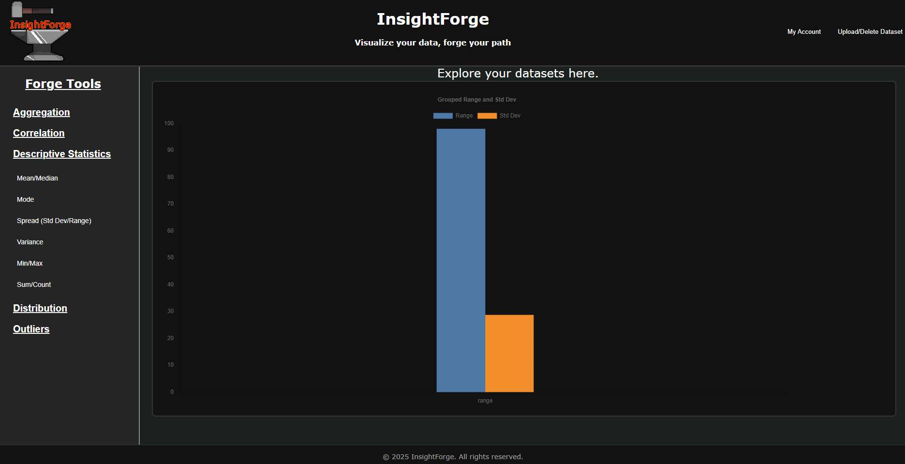
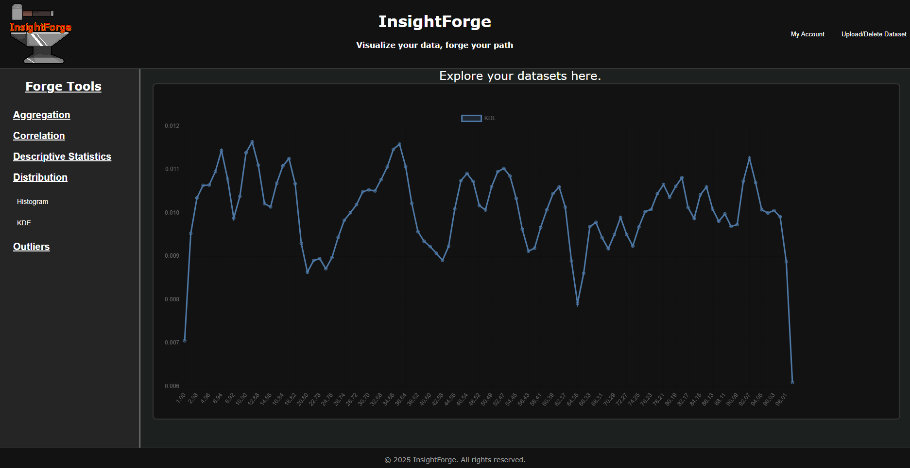
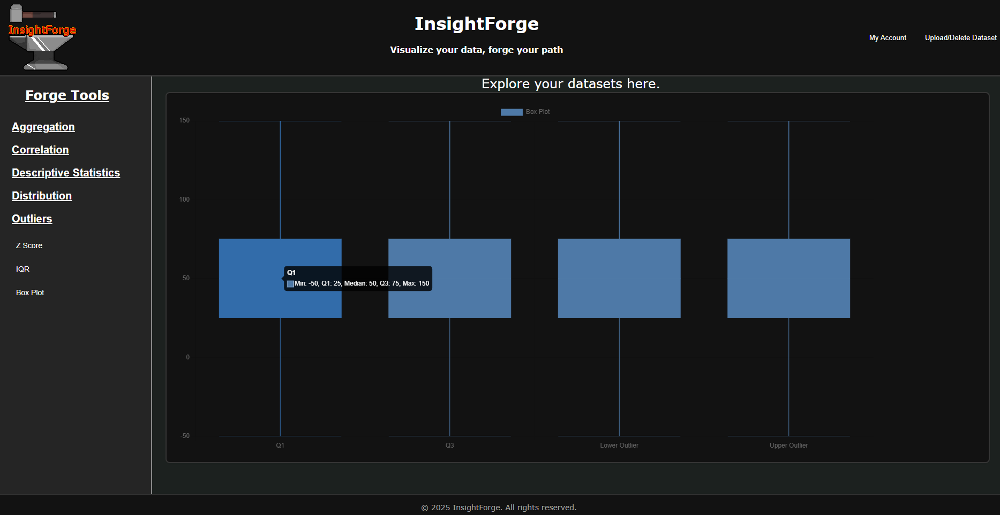
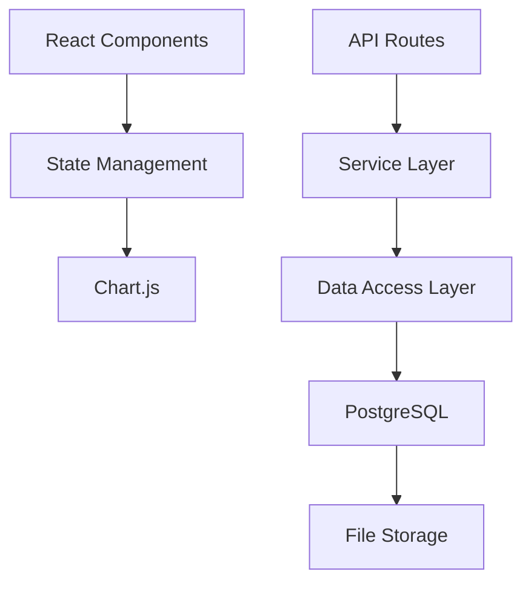

# InsightForge

## Project Overview
A single page web application that allows users to upload datasets and explore them through visualizations and analysis tools.

## Motivation
InsightForge was born out of a desire to simplify exploratory data analysis for users who work with raw CSV files but lack access to or expertise in traditional data tools like Jupyter notebooks for Python or the R programming language. By combining a performant Go backend with a React frontend and visualization libraries like Chart.js, InsightForge makes it easy to analyze, transform, and visualize datasets entirely in the browser. This project brings together best practices in API design, database modeling, secure authentication, and frontend integration.

## Screenshots
  
  
  

## Architecture


## Basic Project Structure
```
/
├── cmd/          # Application entry points
├── internal/     # Private application and library code
│   ├── api/      # API routes and handlers
│   ├── db/       # Database access and models
│   ├── service/  # Business logic
├── migrations/   # Database migrations
├── scripts/      # Helper scripts
├── frontend/     # React frontend application
└── queries/      # SQL queries for SQLC
```

## Dependencies
### Backend
- Go (v1.21.5 or later)
- UUID generation (Googles UUID package v1.6.0 or later)
- PostgreSQL (v17.4 or later)
- Gin Web Framework (v1.10.0 or later)
- Godotenv (v1.5.1 or later)

### Frontend
- Node.js (v21.7.0 or later)
- NPM (v10.5.0 or later)
- Chart.js (for data visualization) (v4.4.8 or later)
- Chartjs Chart Boxplot (v4.4.4 or later)
- Chartjs Chart Matrix (v3.0.0 or later)
- React (v18.3.1 or later)
- React Dom (v18.3.1 or later)
- React Chartjs 2 (v5.3.0 or later)

## Development Tools
- Air (live reloading) (v1.61.7 or later)
- Goose (database migrations) (v3.24.2 or later)
- SQLC (type-safe SQL) (v1.28.0 or later)
- Testify (testing framework) (v1.10.0 or later)
- HTTPTest (v2.2.0 or later)
- Jest (NPM testing) (v29.7.0 or later)
- Babel (Babel-Jest testing) (v7.27.1 or later)

## Features
- Data upload and storage
- Interactive visualizations
- Dataset analysis capabilities
- User accounts and saved projects
- Export options for visualizations

## Quick Start
```bash
# Clone repository
git clone https://github.com/Bgoodwin24/insightforge.git
cd insightforge

# Set up environment variables
cp .env.example .env
# Edit .env with your configuration

# Set up the database
./scripts/migrate.sh up

# Start backend (in one terminal)
air

# Start frontend (in another terminal)
cd frontend
npm install
npm start
```
**Application will be available at:**

Backend API: http://localhost:8080
Frontend: http://localhost:3000

## Setup Instructions
### Clone the repository
``` bash
git clone github.com/Bgoodwin24/insightforge.git
```

### Install dependencies
- Golang
``` bash
sudo apt update
sudo apt install golang-go
```
- Google UUID
``` bash
go get github.com/google/uuid
```
- Gin Web Framework
``` bash
go get -u github.com/gin-gonic/gin
```
- PostgreSQL
``` bash
sudo apt update
sudo apt install postgresql postgresql-contrib
```
- PostgreSQL Driver
``` bash
go get -u github.com/lib/pq
```
- SQLC
``` bash
go install github.com/kyleconroy/sqlc/cmd/sqlc@latest
```
- Goose
``` bash
go install github.com/pressly/goose/v3/cmd/goose@latest
```
- Node.js/NPM
``` bash
sudo apt update
sudo apt install nodejs npm
```
- React
``` bash
npm install react react-dom
```
- Air
``` bash
go install github.com/air-verse/air@latest
```
- Chart.js
``` bash
npm install chart.js @sgratzl/chartjs-chart-boxplot chartjs-chart-matrix react-chartjs-2
```
- Jest
``` bash
npm install --save-dev jest
```
- Babel
``` bash
npm install --save-dev babel-jest @babel/core @babel/preset-env @babel/preset-react
```
- Godotenv
``` bash
go get -u github.com/joho/godotenv
```
- Testify
``` bash
go get -u github.com/stretchr/testify
```
- HTTPTest
``` bash
go get -u github.com/appleboy/gofight/v2
```

## Environment Setup
### Create a .env file in the project root
``` bash
touch .env
```

### Add the following variables to your .env file

```
DB_HOST=localhost
DB_PORT=5432
DB_USER=postgres
DB_PASSWORD=your_password_here
DB_NAME=insightforge
API_PORT=8080
FRONT_END_PORT=3000
API_URL=http://localhost:8080
ENV=development
JWT_SECRET=replace_with_secure_random_string
UPLOAD_DIR=./uploads
MAX_UPLOAD_SIZE=52428800  # 50MB in bytes (this limit could be adjusted in a production environment)
```

**Where the values match your local implementation**

## Database Setup
### Create the database
``` bash
sudo -u postgres createdb your_database_name
```
**Where your_database_name is replaced by your actual database name**

### Using Helper Scripts
This project includes helpful scripts to interact with the database:

#### Database Connection Script
- You need to create your .env based off the example provided in .env.example with your actual local values for these scripts to work!

- Migrations should live in the `migrations` directory at the project root
    - New migrations should follow the convention XXX_relevant_descriptor.sql eg. 001_users.sql, 002_datasets.sql, etc.

``` bash
# Connect to the database using environment variables
./scripts/db.sh
```

- Migration Script
``` bash
# Run migrations Up
./scripts/migrate.sh up

# Run migrations Down
./scripts/migrate.sh down
```

## Running the application
### Start the backend with Air
(Run in a separate terminal that is also "cd'd" to the project root)
``` bash
air
```

### In another terminal, start the frontend
``` bash
cd frontend
npm start
```

### Generate Type-Safe SQL Code
(This is used after SQL queries are created to generate Go code with functions, etc.)
```bash
sqlc generate
``` 

### Expected Input Formats for Analysis
InsightForge supports a variety of analysis tools. Most endpoints operate on datasets previously uploaded via CSV. Once uploaded, each dataset receives a unique dataset_id, which users include in query parameters when requesting analysis or transformations.

⚠️ **Note: All analysis and transformation endpoints fetch data server-side using the dataset_id, row_fields, columns, or method passed in query parameters — no JSON request bodies are required.**

### Authentication Required
All dataset-related endpoints require a valid JWT-based session. Requests without proper authentication will be rejected.

### Frontend-Friendly Responses
All API responses are structured for compatibility with frontend charting libraries (e.g., Chart.js). Output formats are JSON-ready and consistent across endpoints.

### Dataset Upload and ID Usage
When a CSV is uploaded, InsightForge parses and stores its contents. You then reference the dataset using its dataset_id in the query string of analytics requests.

Example dataset upload returns:

```json
{
  "id": "uuid-of-dataset",
  "name": "uploaded_file.csv",
}
```

### Grouped Analytics
Performs operations grouped by a column (e.g., sum of sales by category).

Example Request:

```json
GET /analytics/aggregation/grouped-sum?dataset_id=your_uuid&group_by=Gender&column=SpendingScore
```

Supported endpoints (replace grouped-sum):

grouped-mean

grouped-count

grouped-min

grouped-max

grouped-median

grouped-stddev

Example Response:

```json
{"results":{"A":25,"B":5}}
```

### Pivot Table Operations
Performs pivot-style aggregations across two categorical axes.

Example Request:

```json
GET /analytics/aggregation/pivot-sum?dataset_id=your_uuid&row_field=Age&column=SpendingScore&value_field=Income
```

Other pivot endpoints:

pivot-mean

pivot-min

pivot-max

pivot-count

pivot-median

pivot-stddev
Example Response:

```json
{"agg_func":"sum","column":"product","results":{"North":{"A":100,"B":200},"South":{"A":300}},"row_field":"region","value_field":"sales"}
```

# Summary Statistics
Descriptive stats for a numeric column.

Example Request:

```json
GET /analytics/descriptives/mean?dataset_id=your_uuid&column=SpendingScore
```

Replace `mean` with any of the following to access other statistic endpoints:

median

mode

standard deviation

variance

min

max

sum

range

count

Example Response:

```json
{
  "results": [
    {
      "label": "mean",
      "value": 20
    }
  ]
}
```
Each response includes a `results` array with a single object containing:

- `label`: the type of statistic returned

- `value`: the calculated value (number or array, e.g. for mode)

### Histogram and KDE
Frequency distributions and kernel density estimates.

Histogram Example:

```json
GET /analytics/distribution/histogram?dataset_id=your_uuid&column=SpendingScore
```

Example Response:

```json
{"counts":[2,2,2],"labels":["[1.00, 2.67]","[2.67, 4.33]","[4.33, 6.00]"]}
```

KDE Example:
```json
GET /analytics/distribution/kde?dataset_id=your_uuid&column=SpendingScore
```

Example Response:

```json
{"densities":[0.1398939300142934,0.16764869370173405,0.18530902761596366,0.19434288654157703,0.19779647926952248,0.19779647926952248,0.19434288654157708,0.18530902761596366,0.16764869370173408,0.13989393001429343],"labels":["1.00","1.44","1.89","2.33","2.78","3.22","3.67","4.11","4.56","5.00"]}
```

### Correlation (Pearson, Spearman)
Analyzes relationships between numeric columns.

Example Request:

```json
GET /analytics/correlation/pearson-correlation?dataset_id=your_uuid&row_field=Age&column=SpendingScore
```

Example Response:

Spearman
```json
{"results":{"spearman":-1}}
```

Pearson
```json
{"results":{"pearson":1}}
```

### Correlation Matrix
Find correlation across all numeric columns.

Example Request:

```json
GET /analytics/correlation/correlation-matrix?dataset_id=your_uuid&method=pearson&column=SpendingScore&column=Income
```

Other matrix endpoint

spearman

Example Response:

```json
{"results":{"a":{"a":1,"b":1},"b":{"a":1,"b":1}}}
```

### IQR / Box Plot Data
Computes IQR and box plot summary for a column.

Example Request:

```json
GET /analytics/outliers/iqr-outliers?dataset_id=your_uuid&column=SpendingScore
```

```json
GET /analytics/outliers/boxplot?dataset_id=your_uuid&column=SpendingScore
```

Example Response:

IQR
```json
{
  "column": "value",
  "indices": [4],
  "lowerBound": -7.5,
  "upperBound": 52.5
}
```

BoxPlot
```json
{"labels":["Q1","Q3","Lower Outlier","Upper Outlier"],"stats":{"IQR":52.5,"Q1":12.5,"Q3":65,"lower_outlier":-66.25,"upper_outlier":143.75},"values":[12.5,65,-66.25,143.75]}
```


### Z-Score Outlier Detection
Finds outliers in a column based on z-score threshold.

Example Request:

```json
GET //analytics/outliers/zscore-outliers?dataset_id=your_uuid&column=SpendingScore
```

Example Response:

```json
{"indices":[2]}
```

## Future Considerations
Enhanced keyboard accessibility (ex: escape to close modals, etc.)

The following features are partially implemented and will have their user interface access temporarily disabled:

Apply Log Transform, Drop Rows With Missing, Fill Missing With, Filter/Sort, Group Dataset By, Normalize Column, and Standardize Column.

Note: Although "Group Dataset By" is not fully exposed in the UI, functionality that depends on it (e.g., Grouped Data Analytics) will continue to work by calling the relevant API endpoints directly.

For other security related updates intended for if this were to ever be launched for production see SECURITY.md.

## License

This project is licensed under a **custom restrictive license**.

© 2025 Bgoodwin24. All rights reserved.

The software and associated documentation files (the "Software") are provided solely for your personal, non-commercial use.

You may **NOT** copy, modify, distribute, sublicense, sell, or otherwise exploit the Software in any way without explicit prior written permission from the copyright holder.

For full license details, see the [LICENSE](LICENSE) file.

## Contributing
I would love your help! If you have any ideas or improvements, contribute by forking the repo and opening a pull request to the `main` branch. **Please be sure to write tests for any changes if applicable.

## Author
Bgoodwin24
