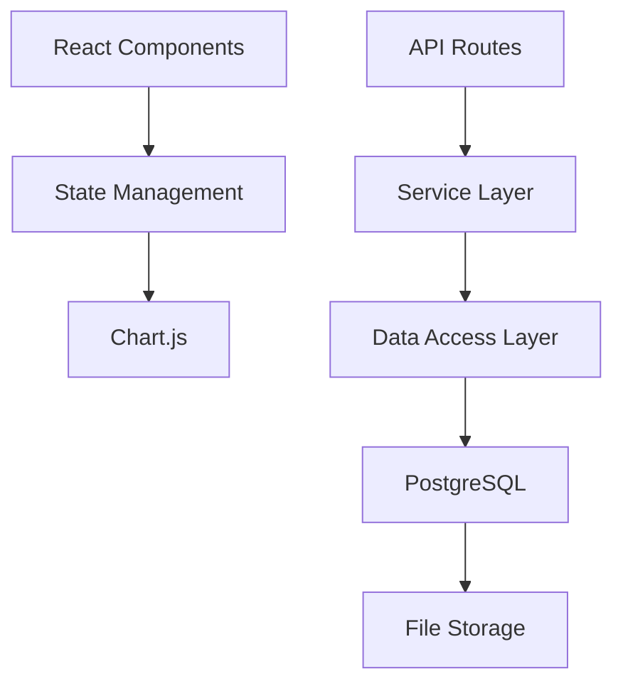

# InsightForge

## Project Overview
A web application that allows users to upload datasets and explore them through visualizations and analysis tools.

## Architecture


## Basic Project Structure
```
/
├── cmd/          # Application entry points
├── internal/     # Private application and library code
│   ├── api/      # API routes and handlers
│   ├── db/       # Database access and models
│   ├── service/  # Business logic
├── migrations/   # Database migrations
├── scripts/      # Helper scripts
├── frontend/     # React frontend application
└── queries/      # SQL queries for SQLC
```

## Dependencies
### Backend
- Go (v1.21.5 or later)
- UUID generation (Googles UUID package v1.6.0 or later)
- PostgreSQL (v17.4 or later)
- Gin Web Framework (v1.10.0 or later)
- Godotenv (v1.5.1 or later)

### Frontend
- Node.js (v21.7.0 or later)
- NPM (v10.5.0 or later)
- Chart.js (for data visualization) (v4.4.8 or later)

## Development Tools
- Air (live reloading) (v1.61.7 or later)
- Goose (database migrations) (v3.24.2 or later)
- SQLC (type-safe SQL) (v1.28.0 or later)
- Testify (testing framework) (v1.10.0 or later)
- HTTPTest (v2.2.0 or later)
- Jest (NPM testing) (v29.7.0 or later)

## Features
- Data upload and storage
- Interactive visualizations
- Dataset analysis capabilities
- User accounts and saved projects
- Export options for visualizations

## Quick Start
```bash
# Clone repository
git clone https://github.com/Bgoodwin24/insightforge.git
cd insightforge

# Set up environment variables
cp .env.example .env
# Edit .env with your configuration

# Set up the database
./scripts/migrate.sh up

# Start backend (in one terminal)
air

# Start frontend (in another terminal)
cd frontend
npm install
npm start
```
**Application will be available at:**

Backend API: http://localhost:8080
Frontend: http://localhost:3000

## Setup Instructions
### Clone the repository
``` bash
git clone github.com/Bgoodwin24/insightforge.git
```

### Install dependencies
- Golang
``` bash
sudo apt update
sudo apt install golang-go
```
- Google UUID
``` bash
go get github.com/google/uuid
```
- Gin Web Framework
``` bash
go get -u github.com/gin-gonic/gin
```
- PostgreSQL
``` bash
sudo apt update
sudo apt install postgresql postgresql-contrib
```
- PostgreSQL Driver
``` bash
go get -u github.com/lib/pq
```
- SQLC
``` bash
go install github.com/kyleconroy/sqlc/cmd/sqlc@latest
```
- Goose
``` bash
go install github.com/pressly/goose/v3/cmd/goose@latest
```
- Node.js/NPM
``` bash
sudo apt update
sudo apt install nodejs npm
```
- Air
``` bash
go install github.com/air-verse/air@latest
```
- Chart.js
``` bash
npm install chart.js
```
- Godotenv
``` bash
go get -u github.com/joho/godotenv
```
- Testify
``` bash
go get -u github.com/stretchr/testify
```
- HTTPTest
``` bash
go get -u github.com/appleboy/gofight/v2
```

## Environment Setup
### Create a .env file in the project root
``` bash
touch .env
```

### Add the following variables to your .env file

```
DB_HOST=localhost
DB_PORT=5432
DB_USER=postgres
DB_PASSWORD=your_password_here
DB_NAME=insightforge
API_PORT=8080
FRONT_END_PORT=3000
API_URL=http://localhost:8080
ENV=development
JWT_SECRET=replace_with_secure_random_string
UPLOAD_DIR=./uploads
MAX_UPLOAD_SIZE=52428800  # 50MB in bytes (this limit could be adjusted in a production environment)
```

**Where the values match your local implementation**

## Database Setup
### Create the database
``` bash
sudo -u postgres createdb your_database_name
```
**Where your_database_name is replaced by your actual database name**

### Using Helper Scripts
This project includes helpful scripts to interact with the database:

#### Database Connection Script
- You need to create your .env based off the example provided in .env.example with your actual local values for these scripts to work!

- Migrations should live in the `migrations` directory at the project root
    - New migrations should follow the convention XXX_relevant_descriptor.sql eg. 001_users.sql, 002_datasets.sql, etc.

``` bash
# Connect to the database using environment variables
./scripts/db.sh
```

- Migration Script
``` bash
# Run migrations Up
./scripts/migrate.sh up

# Run migrations Down
./scripts/migrate.sh down
```

## Running the application
### Start the backend with Air
(Run in a separate terminal that is also "cd'd" to the project root)
``` bash
air
```

### In another terminal, start the frontend
``` bash
cd frontend
npm start
```

### Generate Type-Safe SQL Code
(This is used after SQL queries are created to generate Go code with functions, etc.)
```bash
sqlc generate
``` 

... more to instructions to come

## Screenshots
[Will be added when application UI is developed]

## License
[](LICENSE)
This project is licensed under the terms of the MIT license.

## Author
Bgoodwin24
